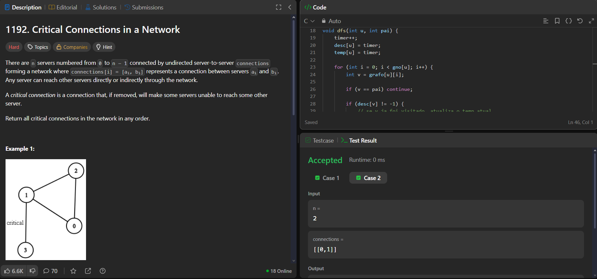
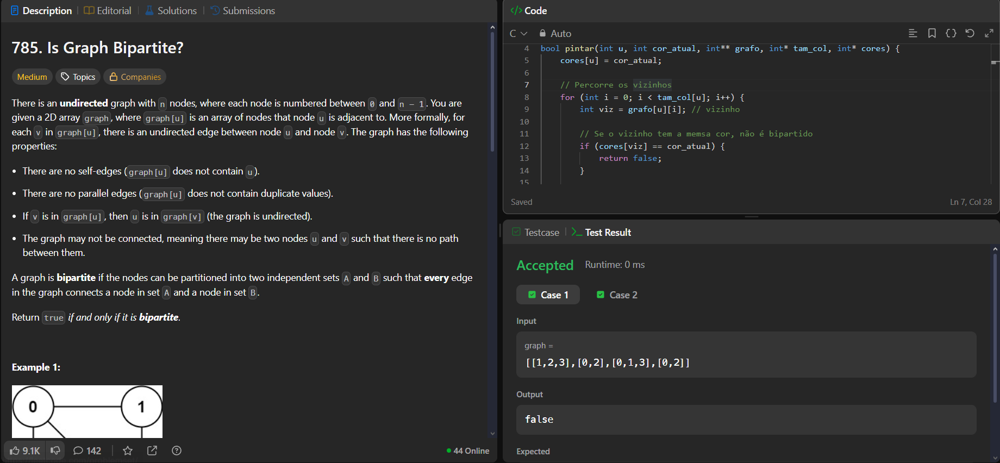
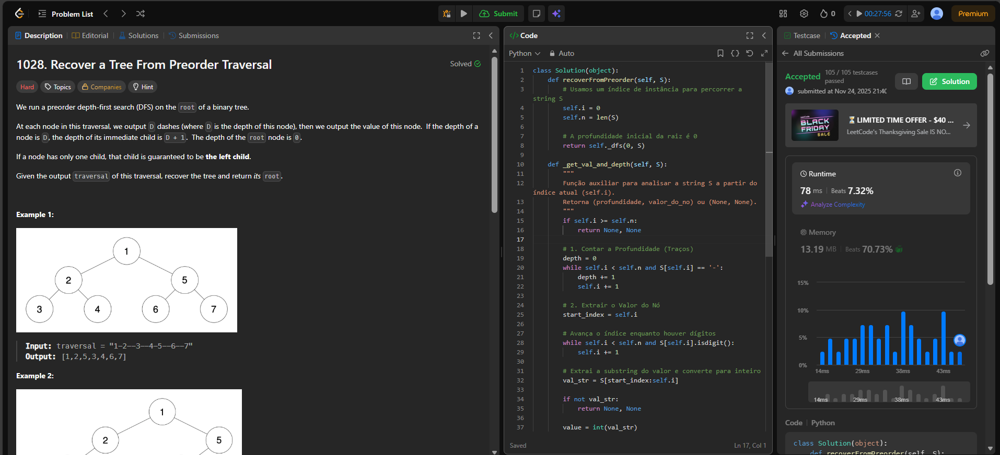
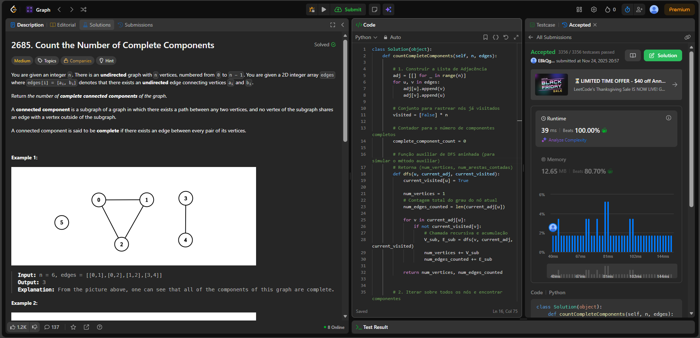

# 🔍 Estrutura de Dados - Grafos

**Conteúdo da Disciplina:**

* **Busca:** Algoritmos de busca
* **Ord_quad:** Algoritmos de ordenação O(n²)
* **Ord_nlogn:** Algoritmos de ordenação O(n*log(n))
* **Arv:** Algoritmos de manipulação de Árvores
* **Grafo:** Algoritmos de manipulação de Grafos

## 👨‍🏫 Alunos

| Matrícula | Aluno |
|---|---|
| 202045482 | [Genilson Silva](https://github.com/GenilsonJrs) |
| 211063111 | [Gustavo Alves](https://github.com/gustaallves) |

## Sobre

Este projeto foi desenvolvido como parte da disciplina de Estrutura de Dados 2 e reúne a resolução de diversos exercícios do <a href="https://leetcode.com/problemset/">Leetcode</a> envolvendo estruturas de dados e técnicas de algoritmos. As questões foram divididas entre os integrantes do grupo, de forma que o Gustavo resolveu 1 questão difícil e 1 de nível médio, enquanto o Genilson resolveu 1 questão difícil e 1 de nível médio. 

## Screenshots

### 👤 [Genilson Silva](https://github.com/GenilsonJrs)

#### 🔴 Questão Difícil

<table border="1">
  <thead>
    <tr>
      <th>Questão</th>
      <th>Resolução</th>
      <th>Vídeo Explicativo</th>
    </tr>
  </thead>
  <tbody>
    <tr>
      <td><a href="https://leetcode.com/problems/critical-connections-in-a-network">1192. Critical Connections in a Network</a></td>
      <td><a href="./1192.c">1192.c</a></td>
      <td><a href="https://www.youtube.com/watch?v=9rY72SO57EM">Link</a></td>
    </tr>
  </tbody>
</table>

  
<strong>Imagem 1 - Resolução do exercício 1192</strong>

  

#### 🟡 Questão Média

<table border="1">
  <thead>
    <tr>
      <th>Questão</th>
      <th>Resolução</th>
      <th>Vídeo Explicativo</th>
    </tr>
  </thead>
  <tbody>
    <tr>
      <td><a href="https://leetcode.com/problems/is-graph-bipartite">785. Is Graph Bipartite?</a></td>
      <td><a href="./785.c">785.c</a></td>
      <td><a href="https://www.youtube.com/watch?v=KIuGeF-VG5U">Link</a></td>
    </tr>   
  </tbody>
</table>

  
<strong>Imagem 2 - Resolução do exercício 785</strong>

  

---

### 👤 [Gustavo Alves](https://github.com/gustaallves)

#### 🔴 Questão Difícil

<table border="1">
  <thead>
    <tr>
      <th>Questão</th>
      <th>Resolução</th>
      <th>Vídeo Explicativo</th>
    </tr>
  </thead>
  <tbody>
    <tr>
      <td><a href="https://leetcode.com/problems/recover-a-tree-from-preorder-traversal/">1028. Recover a Tree From Preorder Traversal</a></td>
      <td><a href="Screenshots/1028.py">1028.py</a></td>
      <td><a href="https://youtu.be/mub7dcKXI34">Link</a></td>
    </tr>
  </tbody>
</table>

  
<strong>Imagem 3 - Resolução do exercício 1028</strong>

  

#### 🟡 Questão Média

<table border="1">
  <thead>
    <tr>
      <th>Questão</th>
      <th>Resolução</th>
      <th>Vídeo Explicativo</th>
    </tr>
  </thead>
  <tbody>
    <tr>
      <td><a href="https://leetcode.com/problems/count-the-number-of-complete-components/description/?envType=problem-list-v2&envId=graph">2685. Count the Number of Complete Components
</a></td>
      <td><a href="./2685.py">2685.py</a></td>
      <td><a href="https://youtu.be/4GKkZGjB6tQ">Link</a></td>
    </tr>
  </tbody>
</table>

  
<strong>Imagem 4 - Resolução do exercício 2685</strong>

  

---

## 🛠️ Como usar o código no LeetCode

Este código foi desenvolvido para ser executado diretamente no **LeetCode**.

### Passos para usar:

1.  **Copie o código** do arquivo.
2.  **Cole o código no editor do LeetCode**.
3.  **Submeta o código**. O LeetCode fornecerá as entradas automaticamente durante a execução.
4.  **O LeetCode executará o código** com as entradas fornecidas e devolverá a resposta.

### Detalhes adicionais:

- O LeetCode gerencia as **entradas e saídas automaticamente**.